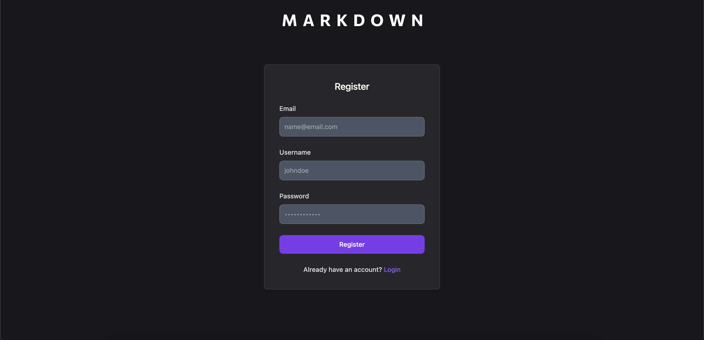
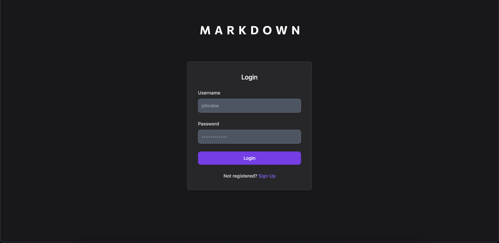
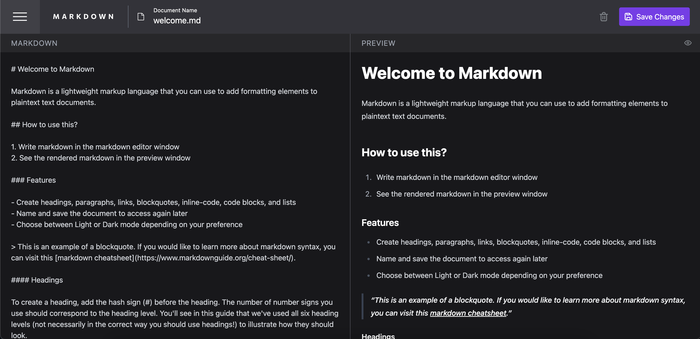

# Markdown Editor

This project is a web-based Markdown editor that allows users to write, edit, and preview Markdown text in real-time. It features a split-view editor and live preview, providing an intuitive interface for creating Markdown documents.

## Features

- Real-Time Preview: See your Markdown rendered as you type.
- File Management: Create, edit, delete, and save Markdown files.
- User Authentication: Sign up and log in to manage your personal files.
- Responsive Design: Works seamlessly on both desktop and mobile devices.

## Tech Stack

- Frontend: React, Vite, TypeScript, Tailwind CSS
- Backend: Node.js, Express, MongoDB
- Deployment: Vercel, Render

## Preview
### Website Link: https://markdown-editor-ashy.vercel.app/

